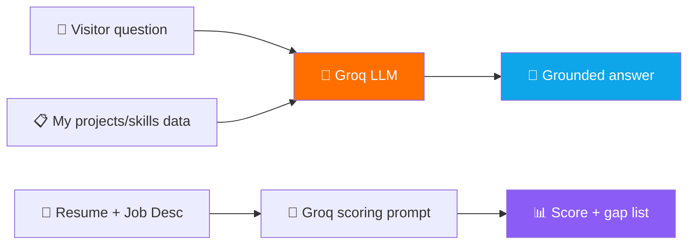

<!-- ══════════════════════ BANNER ══════════════════════ -->
<div align="center">


<a href="https://kartik-s-portfolio-tau.vercel.app">

</a>

<br/><br/>

<a href="https://kartik-s-portfolio-tau.vercel.app"></a>
&nbsp;
<!-- ⚠️ Replace PORTFOLIO_REPO with your actual portfolio repo name -->
<a href="https://github.com/Kartiksahu03/PORTFOLIO_REPO"></a>
&nbsp;
<a href="https://linkedin.com/in/kartik-sahu03"></a>

<br/><br/>


</div>

> [!IMPORTANT]
> ⚠️ I couldn't confirm your portfolio's **GitHub repo name** — replace `PORTFOLIO_REPO` in the Source Code badge above (and in the clone command below) with the actual repo name. The live link is confirmed correct.

<!-- ══════════════════════ DIVIDER ══════════════════════ -->


## 🎯 What is this?

My personal portfolio — but with two AI features baked in. A **Groq-powered chatbot** answers visitor questions about my background and projects, and an **ATS resume scorer** evaluates any uploaded resume against a job description.

<br/>

<!-- ══════════════════════ FEATURES ══════════════════════ -->
<div align="center">

## ✨ Features

</div>

<table>
<tr>
<td width="50%" valign="top">

### 💬 AI Chatbot
- Groq-powered visitor Q&A
- Grounded in my real resume & project data
- Answers stay consistent with the site

</td>
<td width="50%" valign="top">

### 📄 ATS Resume Scorer
- Upload resume + job description
- Prompt-engineered LLM scores the match
- Flags gaps and missing keywords

</td>
</tr>
</table>

<!-- ══════════════════════ DIVIDER ══════════════════════ -->


<!-- ══════════════════════ TECH STACK ══════════════════════ -->
<div align="center">

## 🛠️ Tech Stack


<br/><br/>

| Layer | Technologies |
|:---:|:---|
| **Frontend** | React.js · Tailwind CSS |
| **Backend** | Node.js |
| **AI** | Groq API (LLaMA 3.3) — chatbot & resume scoring |
| **Deploy** | Vercel |

</div>

<!-- ══════════════════════ AI FLOW ══════════════════════ -->
## 🧠 How the AI Features Work



> Both features stay grounded — the chatbot's context is built from the same data files that render the site, so its answers match what's actually shown.

<!-- ══════════════════════ QUICKSTART ══════════════════════ -->


## 🚀 Quick Start

```bash
# ⚠️ replace PORTFOLIO_REPO with your actual repo name
git clone https://github.com/Kartiksahu03/PORTFOLIO_REPO.git
cd PORTFOLIO_REPO
npm install
cp .env.example .env      # VITE_GROQ_API_KEY=your_groq_key
npm run dev
```

Open `http://localhost:5173`. 🎉

<!-- ══════════════════════ ROADMAP ══════════════════════ -->
## 🗺️ Roadmap

- [ ] ✍️ Blog section for write-ups
- [ ] 📈 Analytics on project engagement
- [ ] 🧪 Automated tests for the resume-scoring logic

<!-- ══════════════════════ FOOTER ══════════════════════ -->


<div align="center">

## 👤 Built by Kartik Sahu

Full-Stack Developer · MERN + AI Integration

<a href="https://kartik-s-portfolio-tau.vercel.app"></a>
<a href="https://github.com/Kartiksahu03"></a>
<a href="https://linkedin.com/in/kartik-sahu03"></a>
<a href="mailto:kartik.sahu3311@gmail.com"></a>

<br/><br/>


</div>
